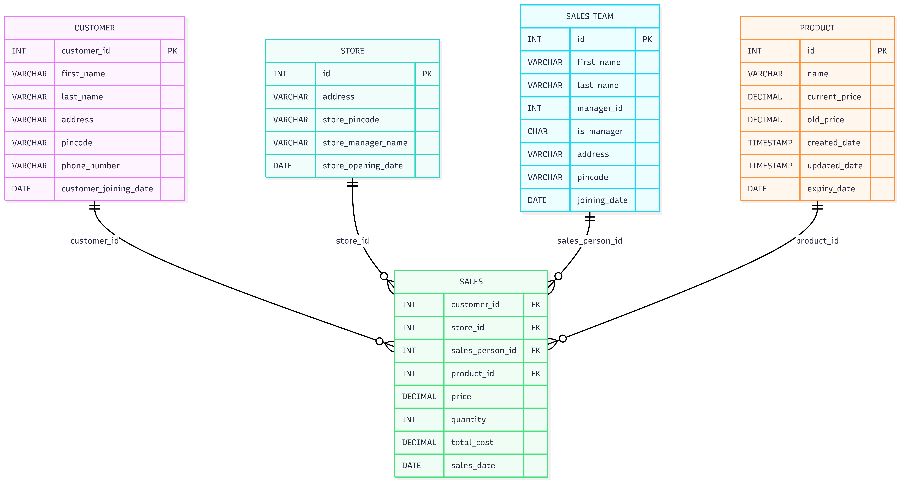

# Retail-Sales-Data-ETL-Pipeline

## Overview

**Retail-Sales-Data-ETL** is an end-to-end batch ETL pipeline built using **PySpark**.  
The project ingests raw sales data from **AWS S3** and dimension data from **MySQL**, applies transformations and validations using Spark, and writes the processed data back to **S3** and **MySQL** for analytics and reporting. This process is orchestrated using Airflow.

This project demonstrates core **data engineering fundamentals** such as distributed data processing, schema modeling, joins between fact and dimension tables, and cloud-based data storage.

---

## High-Level Architecture


**Flow:**
- **Sources**: AWS S3 (raw files), MySQL (dimension tables)
- **Processing**: Apache Spark (PySpark)
- **Sinks**: AWS S3 (processed Parquet data), MySQL (reporting tables)

---

## Data Flow

1. Read raw sales data from **AWS S3**.
2. Perform data validation and schema checks.
3. Read dimension tables from **MySQL**.
4. Apply transformations and business logic using PySpark.
5. Write processed data to:
   - **S3** in Parquet format
   - **MySQL** reporting tables

---

## Database ER Diagram


---
## Tech Stack

| Technology | Usage |
|----------|------|
| Apache Spark | Distributed data processing |
| AWS S3 | Raw and processed data storage |
| MySQL | Dimension tables and reporting tables |
| Parquet | Columnar storage format |
| Python | ETL orchestration|
| Apache Airflow | ETL pipeline orchestration |

---

## Folder Structure
```
Sales-Data-ETL/
├── airflow/
│   └── sales_etl_dag.py
│
├── docs/
│   ├── Architecture.png
│   └── database_schema.png
│
├── resources/
│   ├── dev/
│   │   ├── config.py
│   │   └── requirements.txt
│   │
│   └── sql_scripts/
│       └── create_table_scripts.sql
│
├── scripts/
│   ├── generate_data/
│   │   ├── generate_csv_data.py
│   │   ├── generate_customer_table_data.py
│   │   ├── generate_product_table_data.py
│   │   ├── upload_file_to_s3.py
│   │   └── write_generated_data_to_database.py
│   │
│   └── main/
│       ├── move/
│       │   └── move_files.py
│       │
│       ├── read/
│       │   ├── aws_read.py
│       │   └── database_read.py
│       │
│       ├── transformations/
│       │   └── jobs/
│       │       ├── customer_mart_sql_transform_write.py
│       │       ├── dimension_tables_join.py
│       │       └── sales_mart_sql_transform_write.py
│       │
│       ├── utility/
│       │   ├── encrypt_decrypt.py
│       │   ├── logging_config.py
│       │   ├── spark_session.py
│       │   └── my_sql_session.py
│       │
│       └── write/
│           ├── database_write.py
│           └── format_writer.py
│
└── README.md
```
---

## How to Run

### 1. Clone the repository
```
git clone https://github.com/Aditya-Shinde-21/Retail-Sales-Data-ETL-Pipeline.git
cd Sales-Data-ETL
```
### 2. Create virtual environment
```
python -m venv .venv
source .venv/bin/activate      # Linux / macOS
.venv\Scripts\activate         # Windows
```
### 3. Install dependencies
```
pip install -r requirements.txt
```
Required Windows Subsystem for Linux (WSL) for Airflow if using Windows/macOS setup )

### 4. Configure AWS and MySQL
#### Configure AWS credentials for S3 access and update MySQL connection details in 

### 5. Airflow setup
####

### 6. Generate data and upload it to s3
#### Generate data from  and 
#### Upload data to s3 from 

### 7. ETL orchestration
#### Run ETL orchestration from 
